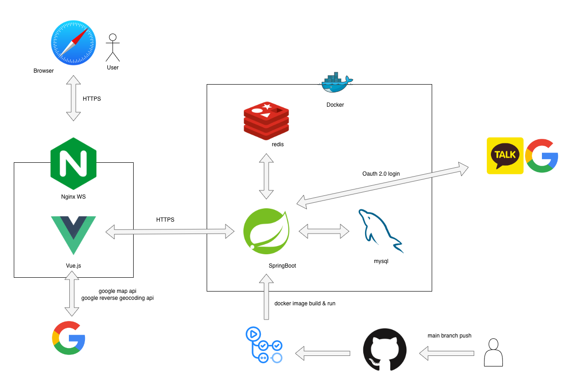

# I'M FINE APPLE BACKEND
프로젝트 IFA의 백엔드서버입니다.

## 프로젝트 아키텍쳐

## 프로젝트 주요 구현 기능
- google map api, google place api를 이용한 위치 검색 및 지도 표시
- 회원가입, 로그인, 로그아웃
- 회원정보 수정
- 게시글 작성, 수정, 삭제
- 게시글 좋아요, 댓글 작성, 삭제
- AWS S3를 이용한 이미지 업로드
- AWS EC2를 이용한 서버 배포
- HTTPS를 이용한 보안 통신
- JWT를 이용한 인증
- 소셜 로그인 (구글, 카카오)
- github actions를 이용한 CI/CD
- docker를 이용한 배포
- JPA, SpEL을 이용한 동적 쿼리 생성

##
## 프로젝트 사용 기술
- Spring Boot / JPA
- DB / MySql / Redis
- AWS / EC2 / S3 / Route53
- Docker
- JWT
- HTTPS
- Github Actions CI/CD
- Google Map API / Google Place API
- Oauth2.0